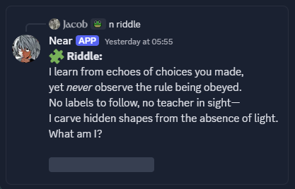
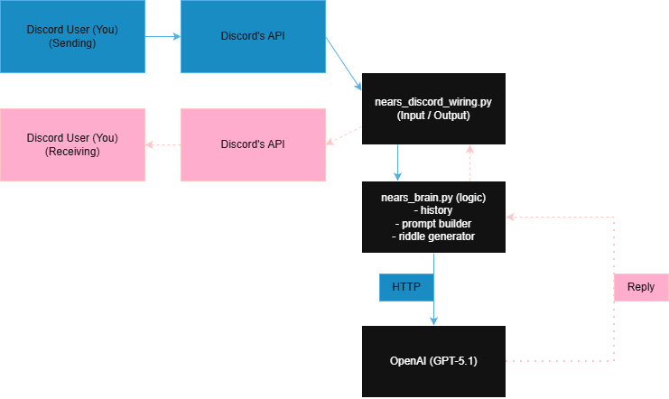
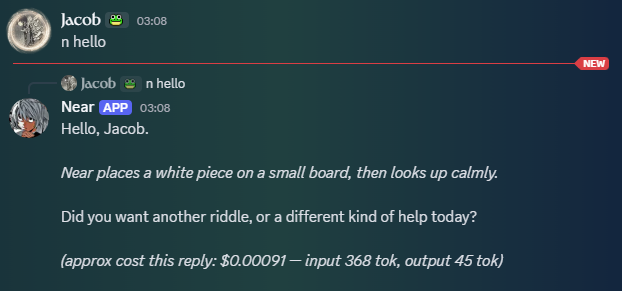

# **Near — A Quiet, Analytical GPT-5.1 Discord Bot**

> Near is a custom Discord bot powered by **OpenAI GPT-5.1**, designed with a very specific personality:
quiet, observant, analytical, emotionally restrained, calm, and subtly creative.

> Near rarely wastes words. He analyzes carefully, answers precisely, and occasionally interacts through
small physical gestures (*a domino clicks, a marble rolls*).  
He feels like a quiet genius sitting across the table, solving puzzles while talking to you.

---

# 📦 **Features**

### ✔ Natural conversation  
`n <message>` or `/near`

### ✔ ELI5 explanations  
`n eli5 <topic>` or `/eli5`

### ✔ Unique tech riddles  
`n riddle`

### ✔ Per-channel short-term memory  
Keeps ~40 messages of recent context. He can:
- recognize who is speaking by their Discord display name

- reference users naturally in his replies

### ✔ Safe message splitting  
Handles long messages and code blocks without breaking formatting.

### ✔ Serialized replies  
Per-channel locks ensure Near never talks over himself.

### ✔ Cost and token estimation
Appends logs on every message (except riddles, for aesthetic purposes).

---



---

## 🧭 Commands

### **Text Commands**
| Command | Description |
|---------|-------------|
| `n <message>` | Talk to Near in this channel |
| `n eli5 <topic>` | Near explains the topic as if you were 5 |
| `n riddle` | Generates a cryptic CS/AI riddle |
| `n help` | Show help message |

### **Slash Commands**
| Command | Description |
|---------|-------------|
| `/near <message>` | Talk to Near using slash interface |
| `/eli5 <topic>` | ELI5 explanation via slash |

---

## 🗂️ Architecture Diagram 
Stored in: **`diagrams/near_architecture.png`**




## 📁 Project Structure
```
project/
│
├── nears_discord_wiring.py   # Discord events, commands, message routing
├── nears_brain.py            # All GPT logic, memory, riddle generation, utilities
├── .env                      # Your tokens (ignored by git)
├── .env.sample               # Template for others
├── requirements.txt          # Python package list
├── README.md                 # This file
└── diagrams/
    └── near_architecture.png # Architecture diagram
└── demo/
    └── nears_example.png     # Screenshot #1 (as seen above)
```

---

## © License
MIT License — free to modify and use however you wish.

---

